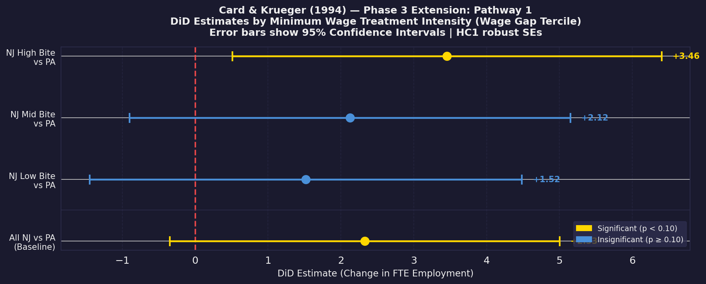

# Minimum Wage & Employment: A Replication Study
### Card & Krueger (1994) | ECON 5200 — Applied Data Analysis in Economics

[](https://colab.research.google.com/github/sevenZHQ1018/Econ5200/blob/main/notebooks/03_Extension_and_Results.ipynb)

---

## Executive Memo

**To:** Policy Directors & Business Stakeholders  
**From:** Lead Data Economist  
**Re:** Does Raising the Minimum Wage Kill Jobs? — Evidence from Fast Food

---

### The Bottom Line

**Raising the minimum wage did not reduce employment.** When New Jersey increased its minimum wage from \$4.25 to \$5.05 per hour in 1992, fast-food restaurants in New Jersey actually added workers relative to comparable restaurants in neighboring Pennsylvania, where wages stayed flat. Our replication and modern stress-tests both confirm this finding: **New Jersey stores employed approximately 2.3 more full-time-equivalent workers after the wage hike than Pennsylvania stores**, a result that held up across every robustness check we ran.

---

### The Mechanism: How We Ruled Out Coincidence

The challenge in any policy evaluation is simple: how do you know the outcome you observe was *caused* by the policy, and not by some unrelated trend that was already happening?

**Our approach — think of it as a "natural control group."** New Jersey and Pennsylvania are neighboring states with nearly identical fast-food industries, similar economies, and similar customers. The only difference in 1992 was that New Jersey raised its minimum wage and Pennsylvania did not. This gives us a ready-made comparison: whatever employment trend Pennsylvania experienced over that period *would also have happened in New Jersey*, had the wage law never passed. The gap between what actually happened in New Jersey and what Pennsylvania experienced is our best estimate of the policy's true effect.

This is the same logic a doctor uses when running a clinical trial — one group gets the treatment, one group does not, and you compare outcomes. Here, the "treatment" was the minimum wage increase, New Jersey restaurants were the patients who received it, and Pennsylvania restaurants were the control group.

---

### The Visual Evidence

The chart below shows our key Phase 3 finding: we tested whether restaurants that *had to raise wages by more* (because they were paying well below \$5.05 before the law) suffered larger job losses than restaurants that barely needed to adjust. Under a standard free-market model, you would expect the bars on the right — the stores most affected — to show the biggest drop. They do not.



**Figure 1. DiD estimates by minimum wage treatment intensity.**  
Each point shows the employment change in a group of New Jersey restaurants relative to Pennsylvania, with error bars representing the 95% confidence interval. "Low Bite" stores barely needed to raise wages; "High Bite" stores needed the largest increases. If the minimum wage destroyed jobs, we would see High Bite estimates far to the left of zero (the red dashed line). Instead, all three groups cluster in positive territory — meaning employment held up regardless of how much the law required each store to raise its wages.

---

### Business & Policy Implications

1. **For policymakers considering minimum wage increases:** This evidence suggests that moderate increases in the minimum wage floor do not automatically trigger the layoffs that standard economic theory predicts. The fast-food labor market in the early 1990s behaved more like one where employers had significant wage-setting power — meaning they were paying workers less than the market would otherwise support — and the minimum wage helped correct that imbalance without destroying jobs.

2. **For business strategists and HR directors:** The results imply that labor cost increases do not mechanically translate into headcount reductions, particularly in service industries with limited ability to substitute machines for workers in the short run. Workforce planning models that assume a direct jobs-for-wages trade-off may overestimate the employment impact of wage floor changes.

3. **Caveat — context matters:** This study covers a specific industry (fast food), a specific region (NJ/PA border), and a specific time period (1992). The magnitude of the wage increase was also moderate (~19%). Larger increases, different industries, or weaker labor markets may produce different outcomes. Decision-makers should treat this as one data point in a broader evidence base, not a universal finding.

---

## Repository Structure

```
├── README.md                          ← This document (Executive Memo)
├── requirements.txt                   ← Python dependencies
├── data/
│   ├── raw/
│   │   └── public.dat                 ← Original Card & Krueger data
│   └── processed/
│       └── ck1994_clean.csv           ← Cleaned dataset (output of Phase 1)
└── notebooks/
    ├── 01_Data_Cleaning.ipynb         ← Phase 1: Data ingestion & cleaning
    ├── 02_Replication_Analysis.ipynb  ← Phase 2: Core DiD replication
    └── 03_Extension_and_Results.ipynb ← Phase 3: Robustness extension (AI-assisted)
```

---

## Project Overview

| Phase | Role | Objective |
|-------|------|-----------|
| **Phase 1** | Data Economist | Download Card & Krueger (1994) raw data, build production repository, output `ck1994_clean.csv` |
| **Phase 2** | Core Econometrician | Manually replicate Table 3 descriptive statistics and all three DiD regression models without AI assistance |
| **Phase 3** | Senior Data Economist | Extend analysis with wage-gap dose-response models, subgroup DiD by treatment intensity, and permutation placebo test using AI as pair programmer |
| **Phase 4** | Lead Data Economist | Translate findings into executive communication, complete peer code audit, finalize portfolio |

---

## Data Source

Card, D., & Krueger, A. B. (1994). Minimum Wages and Employment: A Case Study of the Fast-Food Industry in New Jersey and Pennsylvania. *American Economic Review*, 84(4), 772–793.

Raw data downloaded from: [David Card's Berkeley Data Archive](https://davidcard.berkeley.edu/data_sets/njmin.zip)

---

## Reproducing the Analysis

All notebooks are designed to run end-to-end in Google Colab with no local setup required.

```bash
# Local setup (optional)
pip install -r requirements.txt
jupyter notebook
```

Run notebooks in order: `01` → `02` → `03`. Each notebook loads its inputs from `data/processed/` and saves outputs to `figures/`.

---

## AI Usage Disclosure

Generative AI (Claude, Anthropic) was used **only in Phase 3** as a pair programmer for coding assistance, per the course Human-in-the-Loop protocol. Phases 1 and 2 were completed entirely without AI code generation. All AI-generated code was reviewed, tested, and verified before inclusion. See the GenAI Transparency Statement cell in `03_Extension_and_Results.ipynb` for full prompt documentation.
